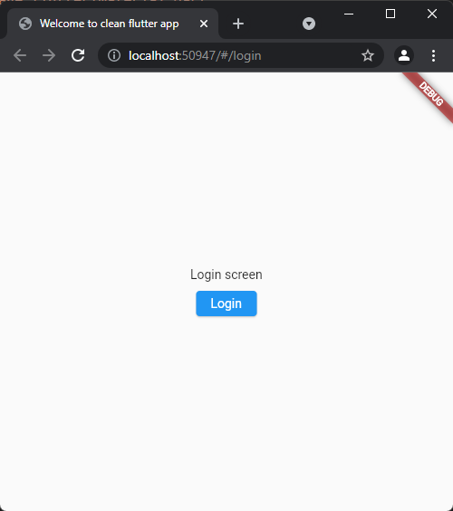
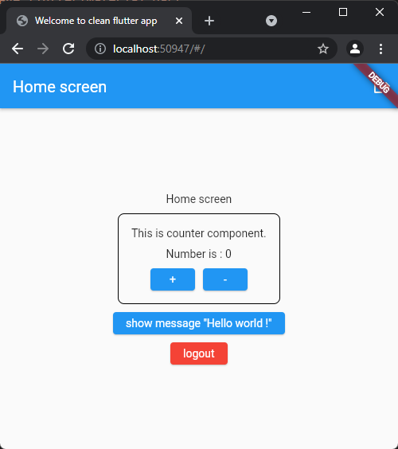
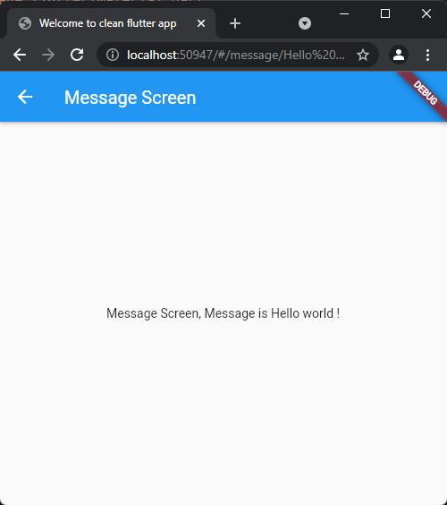

# Flutter Clean Project

A sample flutter app using Injection, routing and simple authentication follows clean code and best practices

## Features
- Cleaned flutter project
- Used linter with rules as errors
- Configured route generator
- Pass parameters / variables through routes
- Simple AuthService & configured Guard for routes
- Well structured flutter project contains Screens, Components, Services and so on..

## Used Packages
- ```dependencies```
  - [auto_route](https://pub.dev/packages/auto_route)
  - [flutter_bloc](https://pub.dev/packages/bloc)
  - [freezed_annotation](https://pub.dev/packages/freezed_annotation)
  - [get_it](https://pub.dev/packages/get_it)
  - [injectable](https://pub.dev/packages/injectable)
- ```dev_dependencies```
  - [auto_route_generator](https://pub.dev/packages/auto_route_generator)
  - [build_runner](https://pub.dev/packages/build_runner)
  - [flutter_lints](https://pub.dev/packages/flutter_lints)
  - [freezed](https://pub.dev/packages/freezed)
  - [injectable_generator](https://pub.dev/packages/injectable_generator)

# Getting Started
## Project root folder
The project root folder is `src`. In order to take advantage of VS Code settings open `src` as your work folder.

## Building

Auto generated files are committed into this repository. if you changed any part of codes which used auto generators you will have a compilation error. This can be
resolved by running the auto generation command to create the sources necessary again
to compile the app.

After checking out the branch simply run:

```bash
flutter pub run build_runner build --delete-conflicting-outputs
```

You can also use the `watch` command to constantly generate files on change:

```bash
flutter pub run build_runner watch --delete-conflicting-outputs
```

## Dependency Injection

Dependency injection is done by using
[Injectable](https://pub.dev/packages/injectable) package.

After you run the `build_runner` [command](#building) a file named
`setup.config.dart` will get generated which holds all the injections.


## Routing

Routing is done by using
[AutoRoute](https://pub.dev/packages/auto_route) package.

There is a service called `router` in `/Services` which using AutoRoute package to generate routes and paths in app.

After you run the `build_runner` [command](#building) a file named
`router.gr.dart` will get generated which holds all the routes and classes used for routing.

also for showcasing how to pass parameters from paths to screens, see [`/home/message/message_screen_v.dart`](https://github.com/moezshakeri/flutter_clean_project/blob/56d767247054896c50d4283c27caa2a5dc601ddb/src/lib/screens/message/message_screen_v.dart)

## State Management

Selected state management for this project is `Cubit`.

The Cubit is a subset of the famous implementation of [BLoC Pattern](https://pub.dev/packages/bloc): [bloclibrary.dev](https://bloclibrary.dev), it abandons the concept of Events and simplifies the way of emitting states.

There are 3 parts for each component / screen to managing the states.
- *`name`*\_m.dart
  * **Model**: this file contains definition of models for state management. to reduce duplicate codes like `copyWith`, `isA[Class]` and so on, I used [Freezed](https://pub.dev/packages/freezed) package to auto generate needed classes and constructors for each state model.

  - each model extends from [BaseState](https://github.com/moezshakeri/flutter_clean_project/blob/56d767247054896c50d4283c27caa2a5dc601ddb/src/lib/base/base_state.dart) class.
- *`name`*\_v.dart
  * **View**: this file contains the view for our component / screen which extends from [BaseView](https://github.com/moezshakeri/flutter_clean_project/blob/56d767247054896c50d4283c27caa2a5dc601ddb/src/lib/base/base_view.dart) class. the `BaseView` class itself extends from `StatelessWidget` and has a getter <T> to get the viewModel inside the view. it's using `locateService<T>()` and Injectable DI.
- *`name`*\_vm.dart
  * **ViewModel**:  this file contains the viewModel for our component / screen which extends from [BaseViewModel<T>](https://github.com/moezshakeri/flutter_clean_project/blob/56d767247054896c50d4283c27caa2a5dc601ddb/src/lib/base/base_viewmodel.dart) class (T is the state Model class). the `BaseViewModel<T>` class itself extends from `cubit<T>`.
  
## Screens

I defined 3 screens in this project.

* Home
  * the root path of application. 
    * have a link to `message` screen with passing a parameter to it.
    * using `AuthService` to logout user.
    * showing `counter` component in it.
* message
  * a screen to demo how to get a parameter in our routing system.
    * the input parameter is defined in view's constructor [`String message`].
    * also in the routing service, I have to define the input parameter for this screen.
* login
  * login screen with a simple button and use `AuthService` to do the fake login in application.
    * there is optional parameter called `redirectPath` which used by router to navigate user back to where he/she been after successful login.
    * to guard selected routes and navigate user to this screen, I defined class `AuthenticatedUser` in the routing service class.

> there is a file in each folder with **`folder_name.dart`** pattern name, which includes exports of files inside that folder. I use this pattern to minimize imports for other parts of application and classes. in usage we only need to import `components.dart` or `screens.dart` to use each folders implementations.

## Components

Right now there is only one component in this project to demonstrate how to use components in screens.

* counter
  * a simple counter component with cubit state management.
  * I used this component inside the [`Home`](https://github.com/moezshakeri/flutter_clean_project/blob/56d767247054896c50d4283c27caa2a5dc601ddb/src/lib/screens/home/home_screen_v.dart) screen.

## Images






## Contact me

if you have any question or suggestion, please contact me :
- [linkedin.com/in/moez-shakeri](https://www.linkedin.com/in/moez-shakeri/)
- [instagram.com/moezshakeri](https://www.instagram.com/moezshakeri/)
- [telegram/MoezShakeri](https://t.me/MoezShakeri)
